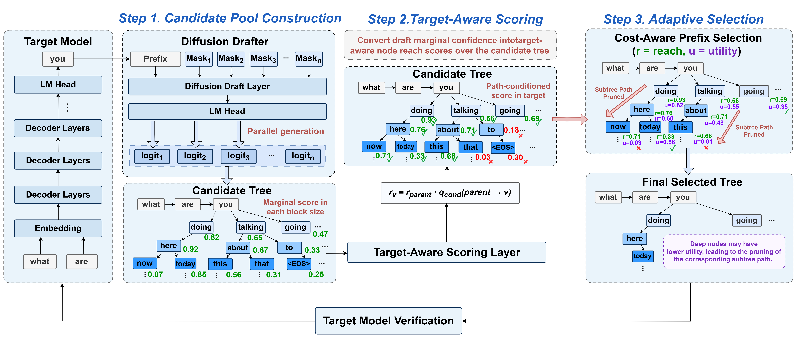

# TAPS: Target-Aware Prefix Tree Selection for Speculative Decoding

TAPS is a learned proposal selector for DDTree-style speculative decoding. Given a DFlash block-parallel draft model, TAPS builds a large candidate pool from draft logits, scores each candidate node with a lightweight scorer, and selects a compact, high-quality verification tree for the target model. The result is higher acceptance length with minimal throughput overhead.



## Method

Each speculative decoding round proceeds as:

1. **Draft**: The DFlash draft model produces block-parallel draft logits in one forward pass.
2. **Lattice extraction**: Extract top-K token candidates at each draft position.
3. **Candidate pool construction**: CPU beam search builds a 768-node candidate trie from draft cumulative log probabilities (~0.3 ms).
4. **Scorer**: A 177K-parameter `TAPSLiteScorer` scores every candidate edge using target-model token embeddings, draft hidden states, and positional features (~1.2 ms on GPU).
5. **Selection**: Reach-based utility ranking + prefix-closed closure selects the best 64 nodes for verification.
6. **Verification**: The target model verifies the selected tree in a single forward pass.

The scorer uses a hybrid pipeline: CPU numpy beam search for fast pool construction, GPU MLP for accurate scoring with correct parent context.

## Installation

Tested with Python 3.11, PyTorch 2.x with CUDA, and an NVIDIA A800/A100 GPU.

```bash
git clone https://github.com/wzyyy-lab/TAPS-EMNLP2026.git
cd TAPS-EMNLP2026
python -m venv .venv
source .venv/bin/activate
pip install -U pip
pip install -r requirements.txt
```

The `flash-attn` package requires a CUDA build toolchain. If installation fails, install it separately following [flash-attention instructions](https://github.com/Dao-AILab/flash-attention).

## Quick Start

```bash
export TARGET_MODEL=/path/to/Qwen3-4B
export DRAFT_MODEL=/path/to/Qwen3-4B-DFlash-b16
export SCORER_CKPT=/path/to/taps_scorer/best.pt
```

### Run TAPS (hybrid selection)

```bash
python benchmark.py \
  --model-name-or-path "$TARGET_MODEL" \
  --draft-name-or-path "$DRAFT_MODEL" \
  --dataset gsm8k \
  --shuffle-seed 2026 \
  --max-new-tokens 2048 \
  --save-path outputs/taps_hybrid_gsm8k.pt \
  --proposal-mode joint \
  --tree-budget 64 \
  --tiny-scorer-checkpoint "$SCORER_CKPT" \
  --joint-topk 64 \
  --candidate-pool-nodes 768 \
  --candidate-pool-sequences 48 \
  --candidate-pool-source taps_lite \
  --min-verify-nodes 4 \
  --max-verify-nodes 192 \
  --min-verify-sequences 4 \
  --max-verify-sequences 64 \
  --no-fallback-to-ddtree \
  --fallback-backend none \
  --hybrid
```

The `--hybrid` flag enables the hybrid selection pipeline (CPU beam search + GPU scoring).

### Run DDTree baseline

```bash
python benchmark.py \
  --model-name-or-path "$TARGET_MODEL" \
  --draft-name-or-path "$DRAFT_MODEL" \
  --dataset gsm8k \
  --shuffle-seed 2026 \
  --max-new-tokens 2048 \
  --save-path outputs/ddtree_gsm8k.pt \
  --proposal-mode ddtree \
  --tree-budget 512
```

## Datasets

The benchmark loader supports the following datasets:

| Dataset | Source | Domain |
| --- | --- | --- |
| `aime25` | [MathArena/aime_2025](https://huggingface.co/datasets/MathArena/aime_2025) | Math reasoning |
| `gsm8k` | [openai/gsm8k](https://huggingface.co/datasets/openai/gsm8k) | Math reasoning |
| `math500` | [HuggingFaceH4/MATH-500](https://huggingface.co/datasets/HuggingFaceH4/MATH-500) | Math reasoning |
| `humaneval` | [openai/openai_humaneval](https://huggingface.co/datasets/openai/openai_humaneval) | Code generation |
| `livecodebench` | [livecodebench/code_generation_lite](https://huggingface.co/datasets/livecodebench/code_generation_lite) | Code generation |
| `mbpp` | [google-research-datasets/mbpp](https://huggingface.co/datasets/google-research-datasets/mbpp) | Code generation |
| `mt-bench` | [HuggingFaceH4/mt_bench_prompts](https://huggingface.co/datasets/HuggingFaceH4/mt_bench_prompts) | Multi-turn dialogue |

Datasets are automatically downloaded from Hugging Face on first use. Alternatively, place local copies under a directory and set `TAPS_HF_ASSETS` to point to it.

## Reproduce from Scratch

The full pipeline has three stages: trace collection, scorer training, and benchmarking. Shell scripts are provided under `scripts/` for each stage.

### Step 1: Collect Traces

Traces record draft logits, candidate tries, and target-model acceptance labels for training the scorer.

```bash
bash scripts/collect_traces.sh
```

On a single A800 GPU, expect ~2 hours per dataset.

### Step 2: Train Scorer

The `TAPSLiteScorer` (177K parameters) is trained with two losses: KL divergence on per-parent conditional distributions + BCE on reach propagation.

```bash
bash scripts/train.sh
```

Training takes ~10 minutes on a single GPU. The best checkpoint is saved to `outputs/scorer/best.pt`.

### Step 3: Benchmark

Run the full benchmark comparing DDTree baseline with TAPS (hybrid selection) on all 7 datasets:

```bash
bash scripts/benchmark.sh
```

## Scorer Architecture

The `TAPSLiteScorer` has 176,894 trainable parameters:

| Component | Shape | Parameters | Description |
| --- | --- | --- | --- |
| `token_proj` | 2560 → 32 | 81,920 | Projects target model embeddings to 32-dim |
| `hidden_proj` | 2560 → 32 | 81,920 | Projects draft hidden states to 32-dim |
| `edge_mlp` | 111 → 64 → 1 | 7,233 | Scores child-parent edges |
| `other_mlp` | 79 → 64 → 1 | 5,185 | Scores "other" (uncovered) probability per parent |
| norms + depth_embed | — | 636 | LayerNorm, depth embedding |

The scorer uses frozen target-model token embeddings (via `token_proj`) and draft-model hidden states (via `hidden_proj`). Only the projection layers and MLPs are trained. The `edge_mlp` input concatenates: child embedding (32), parent embedding (32), depth embedding (8), scalar features (7), hidden projection (32) = 111 dimensions.

## Project Structure

```
├── benchmark.py                 # Main benchmark entry point
├── ddtree.py                    # DDTree baseline generation
├── dflash.py                    # DFlash generation + timing utilities
├── distributed.py               # Multi-GPU distributed utilities
├── requirements.txt
├── assets/
│   └── pipeline.png             # Method overview figure
├── model/
│   ├── __init__.py
│   ├── dflash.py                # DFlash draft model
│   └── utils.py                 # Dataset loading, sampling utilities
├── joint/
│   ├── __init__.py
│   ├── config.py                # JointDDTConfig dataclass
│   ├── lattice.py               # Top-K lattice extraction
│   ├── pool.py                  # Candidate trie construction
│   ├── runtime.py               # Joint generation loop
│   ├── segments.py              # Grouped softmax, KL divergence
│   ├── selector.py              # Reach propagation, prefix-closed selection
│   ├── taps_lite_scorer.py      # TAPSLiteScorer model + hybrid selection
│   ├── trace.py                 # Trace data structures for collection
│   └── tree.py                  # Verification tree compilation
└── scripts/
    ├── collect_trace.py         # Trace collection script
    ├── train_scorer.py          # Scorer training script
    ├── collect_traces.sh        # Step 1: run trace collection
    ├── train.sh                 # Step 2: run scorer training
    └── benchmark.sh             # Step 3: run full benchmark
```

## Acknowledgements

TAPS builds on the [DDTree](https://github.com/z-lab/dflash) and [DFlash](https://github.com/z-lab/dflash) speculative decoding framework.
